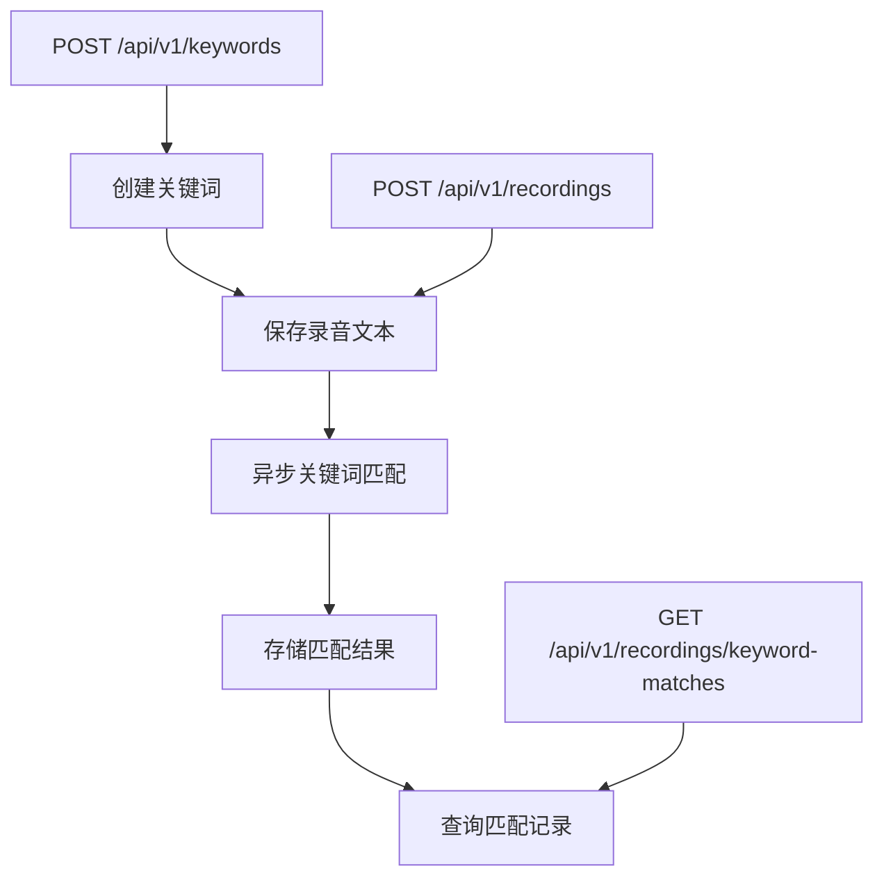

# 关键词匹配系统 API 接口总结

## 📋 接口概览

关键词匹配系统提供以下API接口：

### 1. 关键词管理接口
- **基础路径**: `/api/v1/keywords`
- **功能**: 关键词的增删改查
- **文档**: [keywords_api.md](keywords_api.md)

### 2. 关键词匹配查询接口
- **基础路径**: `/api/v1/recordings/keyword-matches`
- **功能**: 查询关键词匹配记录
- **文档**: [keyword_matching_api.md](keyword_matching_api.md)

## 🔗 接口关系

```
关键词管理 → 创建关键词 → 录音保存 → 自动匹配 → 匹配记录查询
    ↓              ↓           ↓          ↓           ↓
POST /keywords  GET /keywords  POST /recordings  异步处理   GET /keyword-matches
```

## 📊 数据流程

1. **创建关键词** → 2. **保存录音** → 3. **自动匹配** → 4. **查询结果**

### 详细流程



## 🚀 快速开始

### 1. 创建关键词
```bash
curl -X POST "http://localhost:8080/api/v1/keywords" \
  -H "Authorization: Bearer your_token" \
  -H "Content-Type: application/json" \
  -d '{
    "keyword": "投诉",
    "synonyms": "抱怨, 不满, 问题, 意见",
    "mark_color": "#ff4d4f"
  }'
```

### 2. 保存录音（自动触发匹配）
```bash
curl -X POST "http://localhost:8080/api/v1/recordings" \
  -H "Authorization: Bearer your_token" \
  -H "Content-Type: application/json" \
  -d '{
    "session_id": "test_session_001",
    "audio_id": "test_audio_001",
    "mac_address": "aa:bb:cc:dd:ee:01",
    "speaker": {
      "speaker_id": "speaker_001",
      "speaker_name": "客户A"
    },
    "text": "我对这个产品的质量很不满，想要投诉，服务态度也有问题",
    "timestamp": 1703123456789,
    "status": 1
  }'
```

### 3. 查询匹配结果
```bash
# 根据MAC地址查询
curl -X GET "http://localhost:8080/api/v1/recordings/keyword-matches?mac_address=aa:bb:cc:dd:ee:01" \
  -H "Authorization: Bearer your_token"

# 根据关键词ID查询
curl -X GET "http://localhost:8080/api/v1/recordings/keyword-matches?keyword_id=1" \
  -H "Authorization: Bearer your_token"
```

## 📝 接口列表

### 关键词管理接口

| 方法 | 路径 | 功能 | 说明 |
|------|------|------|------|
| GET | `/api/v1/keywords` | 获取关键词列表 | 支持分页、搜索、颜色筛选 |
| GET | `/api/v1/keywords/:id` | 获取单个关键词 | 根据ID获取关键词详情 |
| POST | `/api/v1/keywords` | 创建关键词 | 创建新的关键词 |
| PUT | `/api/v1/keywords/:id` | 更新关键词 | 更新现有关键词 |
| DELETE | `/api/v1/keywords/:id` | 删除关键词 | 删除指定关键词 |
| DELETE | `/api/v1/keywords/batch` | 批量删除关键词 | 批量删除多个关键词 |

### 关键词匹配查询接口

| 方法 | 路径 | 功能 | 说明 |
|------|------|------|------|
| GET | `/api/v1/recordings/keyword-matches` | 查询匹配记录 | 支持多种查询条件 |

## 🔍 查询参数

### 关键词匹配查询参数

| 参数名 | 类型 | 必填 | 说明 | 示例 |
|--------|------|------|------|------|
| mac_address | string | 否 | MAC地址筛选 | "aa:bb:cc:dd:ee:01" |
| keyword_id | number | 否 | 关键词ID筛选 | 1 |
| recording_id | number | 否 | 录音ID筛选 | 123 |
| offset | number | 否 | 偏移量，默认0 | 0 |
| limit | number | 否 | 每页数量，默认20，最大100 | 20 |

## 📊 响应格式

### 统一响应格式
```json
{
  "code": 200,
  "message": "success",
  "result": {
    // 具体数据
  }
}
```

### 关键词匹配记录格式
```json
{
  "id": 1,
  "recording_id": 123,
  "mac_address": "aa:bb:cc:dd:ee:01",
  "keyword_id": 1,
  "keyword": "投诉",
  "matched_text": "投诉",
  "match_type": "exact",
  "confidence": 1.0,
  "position": 15,
  "length": 2,
  "created_at": 1703123456789
}
```

## 🧪 测试工具

### 1. 关键词管理测试
```bash
./test_keywords_api.sh
```

### 2. 关键词匹配测试
```bash
./test_keyword_matching.sh
```

### 3. 关键词匹配API测试
```bash
./test_keyword_matching_api.sh
```

## ⚡ 性能特点

- **异步处理**: 关键词匹配不阻塞录音保存
- **批量操作**: 支持批量保存匹配结果
- **索引优化**: 使用复合索引提高查询性能
- **分页支持**: 避免大量数据加载

## 🔧 配置说明

### 匹配配置
- 精确匹配置信度: 1.0
- 近义词匹配置信度: 0.8
- 最大关键词数量: 1000

### 查询配置
- 默认分页大小: 20
- 最大分页大小: 100
- 支持多种查询条件组合

## 📚 相关文档

- [关键词管理API文档](keywords_api.md) - 详细的关键词管理接口文档
- [关键词匹配API文档](keyword_matching_api.md) - 详细的关键词匹配查询接口文档
- [关键词匹配快速参考](KEYWORD_MATCHING_API_QUICK.md) - 快速参考指南
- [关键词匹配设计文档](KEYWORD_MATCHING_DESIGN.md) - 系统设计文档
- [关键词匹配实现总结](KEYWORD_MATCHING_SUMMARY.md) - 实现总结文档

## 🚨 注意事项

1. **认证**: 所有接口都需要有效的Bearer Token
2. **异步处理**: 关键词匹配是异步的，可能存在短暂延迟
3. **查询条件**: 建议至少指定一个查询条件
4. **分页**: 建议使用分页查询，避免大量数据加载
5. **错误处理**: 请根据返回的错误码进行相应的错误处理

## 🎯 使用建议

1. **开发阶段**: 使用测试脚本验证功能
2. **生产环境**: 根据实际需求调整查询参数
3. **性能优化**: 使用合适的查询条件和分页
4. **监控**: 关注匹配成功率和查询性能
5. **维护**: 定期清理旧的匹配记录
