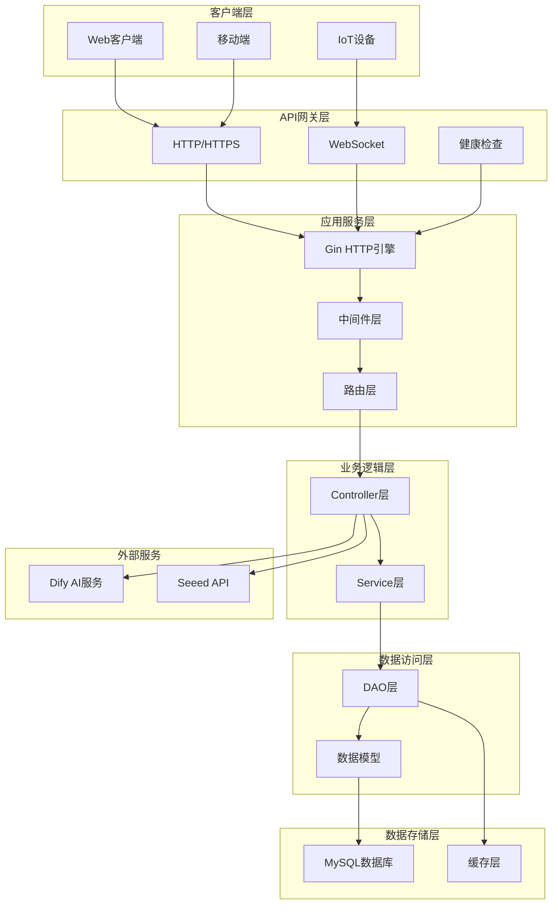
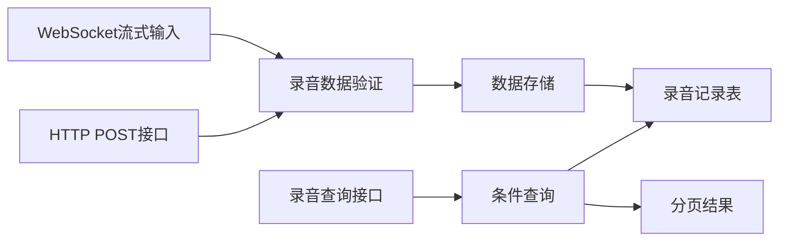
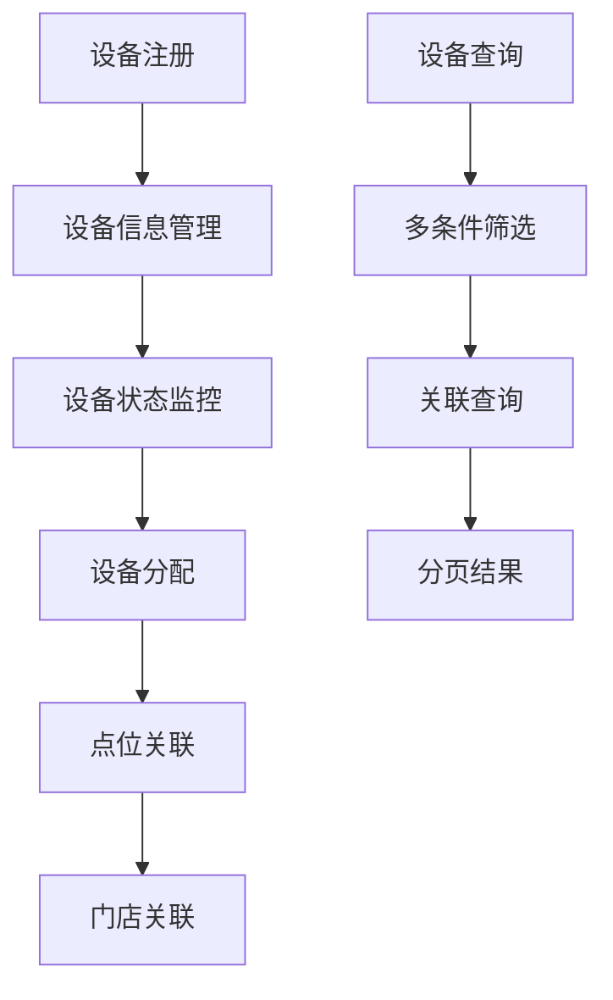
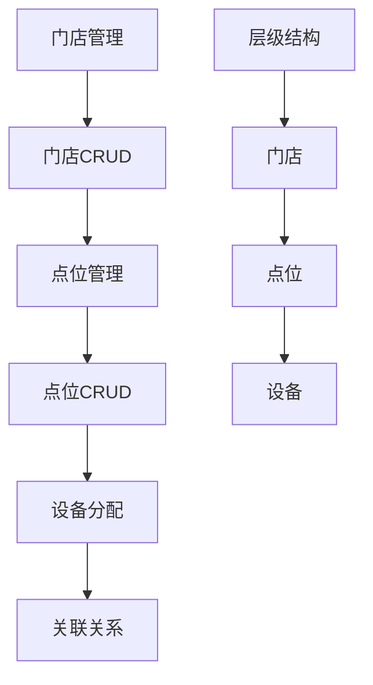
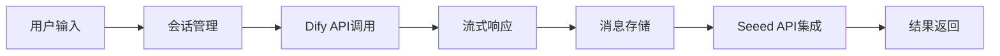
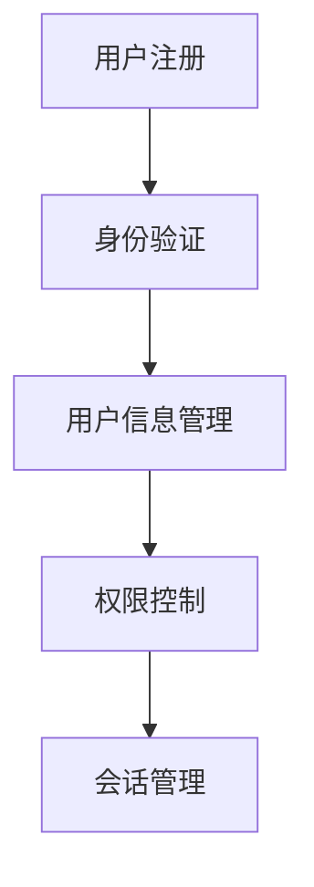
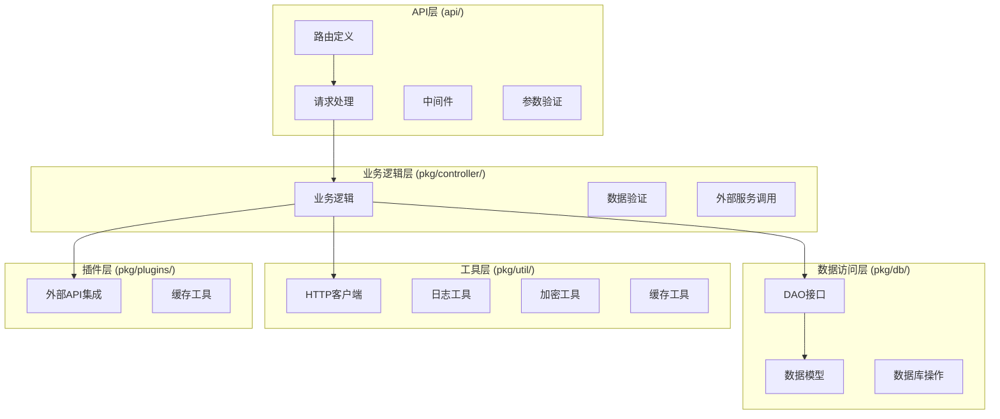
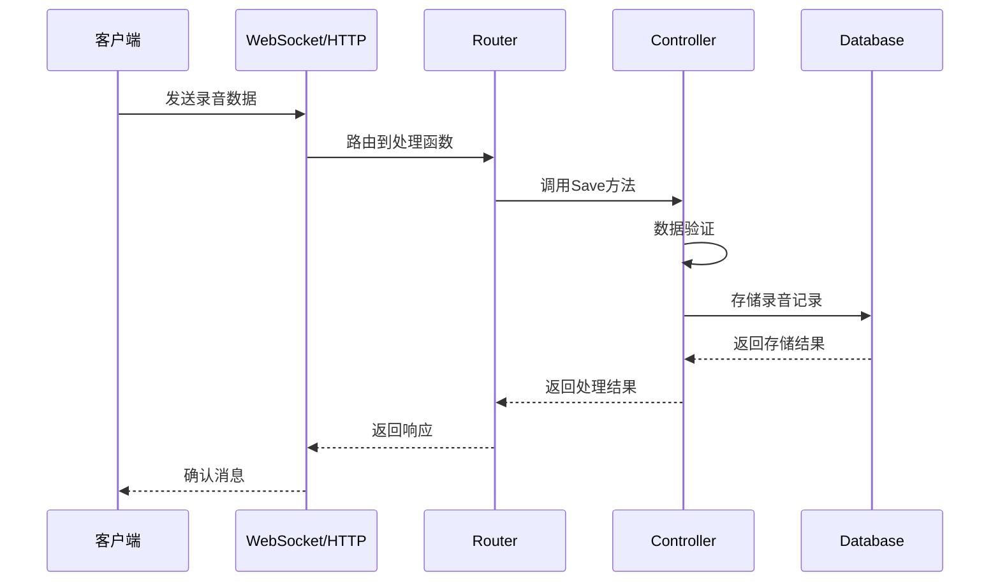
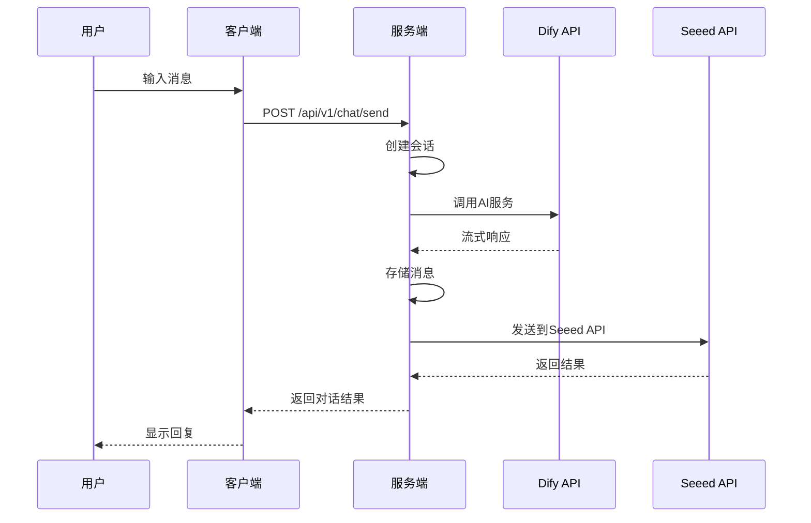
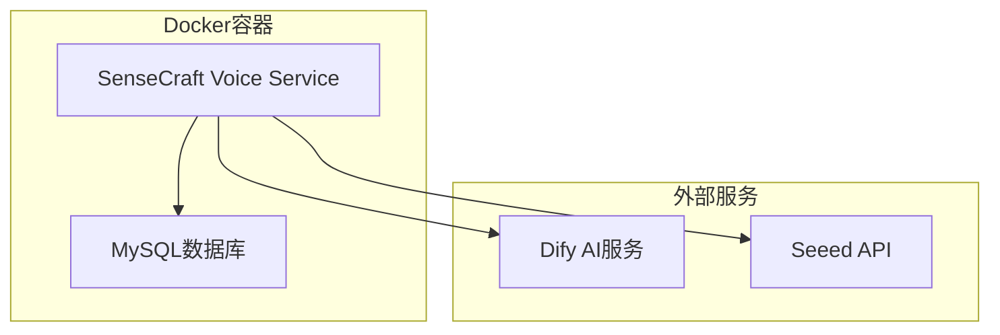

# SenseCraft Voice Service 系统架构文档

## 📋 系统概述

SenseCraft Voice Service 是一个基于Go语言开发的语音识别服务系统，采用分层架构设计，支持语音录制、识别、存储、聊天对话等核心功能。

## 🏗️ 系统架构

### 整体架构图



## 🎯 核心模块

### 1. 录音管理模块 (Recording)



**功能特性:**
- 支持WebSocket实时流式录音数据接收
- 支持HTTP POST批量录音数据提交
- 支持按设备、时间、门店等条件查询
- 自动处理中间结果和最终结果

### 2. 设备管理模块 (Device)



### 3. 门店点位管理模块 (Store & Location)



### 4. 聊天对话模块 (Chat)



### 5. 用户管理模块 (User)



## 🔧 技术栈

### 后端技术
- **语言**: Go 1.19+
- **Web框架**: Gin
- **数据库**: MySQL 8.0+
- **ORM**: GORM
- **WebSocket**: Gorilla WebSocket
- **配置管理**: Viper
- **日志**: klog
- **容器化**: Docker

### 外部集成
- **AI服务**: Dify API
- **硬件集成**: Seeed API
- **文档**: Swagger

## 📁 代码结构

### 分层架构



### 目录结构

```
sensecraft-voice-service/
├── api/server/           # API服务层
│   ├── router/          # 路由层
│   ├── middleware/      # 中间件
│   ├── httputils/       # HTTP工具
│   └── validator/       # 参数验证
├── pkg/                 # 核心包
│   ├── controller/      # 业务逻辑层
│   ├── db/             # 数据访问层
│   ├── util/           # 工具包
│   ├── plugins/        # 插件
│   └── types/          # 类型定义
├── cmd/app/            # 应用入口
├── docs/               # 文档
└── config.yaml         # 配置文件
```

## 🔄 数据流

### 录音数据流



### 聊天对话流



## 🛡️ 安全机制

### 认证授权
- Token验证
- 权限控制 (Casbin)
- 请求限流
- CORS支持

### 数据安全
- 密码MD5加密
- 输入参数验证
- SQL注入防护
- 错误信息脱敏

## 📊 监控与日志

### 日志系统
- 结构化日志 (JSON格式)
- 分级日志 (Info/Warn/Error)
- 请求链路追踪
- 性能监控

### 健康检查
- `/healthz` 端点
- 数据库连接检查
- 外部服务状态检查

## 🚀 部署架构

### Docker部署



### 配置管理
- 环境变量支持
- 配置文件热加载
- 多环境配置

## 🔮 扩展性设计

### 水平扩展
- 无状态服务设计
- 数据库读写分离
- 缓存层支持
- 负载均衡友好

### 功能扩展
- 插件化架构
- 模块化设计
- 接口标准化
- 版本兼容性

## 📈 性能优化

### 数据库优化
- 索引优化
- 查询优化
- 连接池管理
- 分页查询

### 缓存策略
- LRU缓存
- Token缓存
- 用户信息缓存
- 查询结果缓存

## 🧪 测试策略

### 测试覆盖
- 单元测试
- 集成测试
- API测试
- 性能测试

### 测试工具
- 内置测试脚本
- 自动化测试
- 压力测试
- 监控告警

---

## 📝 总结

SenseCraft Voice Service 采用现代化的微服务架构设计，具有以下特点：

✅ **高可扩展性**: 模块化设计，易于扩展新功能  
✅ **高性能**: 异步处理，缓存优化，数据库优化  
✅ **高可用性**: 健康检查，错误处理，优雅关闭  
✅ **易维护性**: 清晰的分层架构，标准化接口  
✅ **安全性**: 完整的认证授权，数据加密，输入验证  

系统为语音识别和智能对话提供了完整的解决方案，支持多种客户端接入方式，具备良好的扩展性和维护性。
