# SenseCraft Voice Service 架构图表

## 1. 整体系统架构

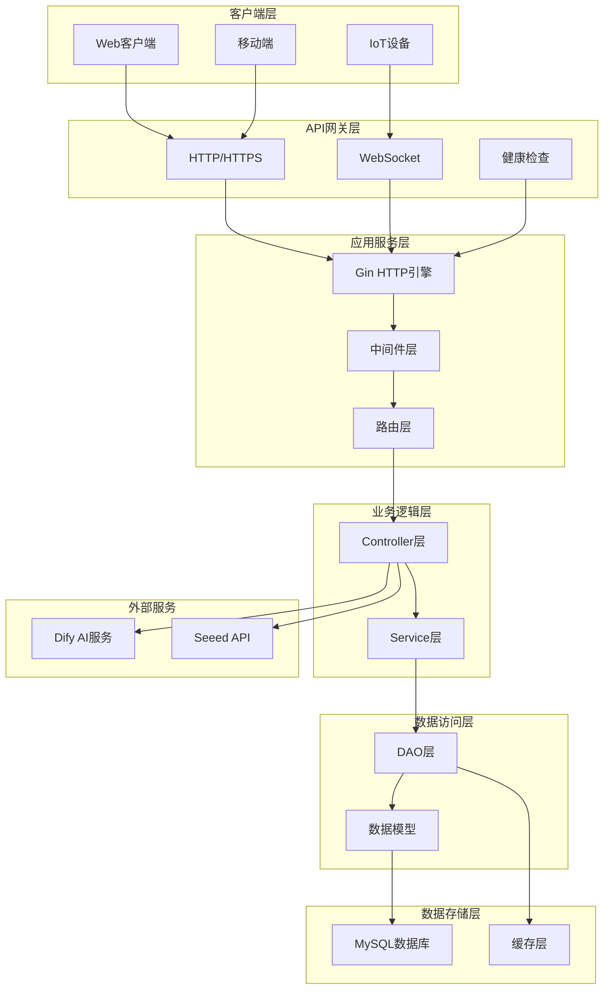

## 2. 录音管理模块架构

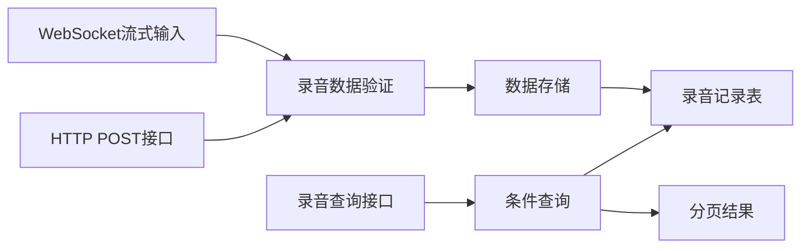

## 3. 设备管理模块架构

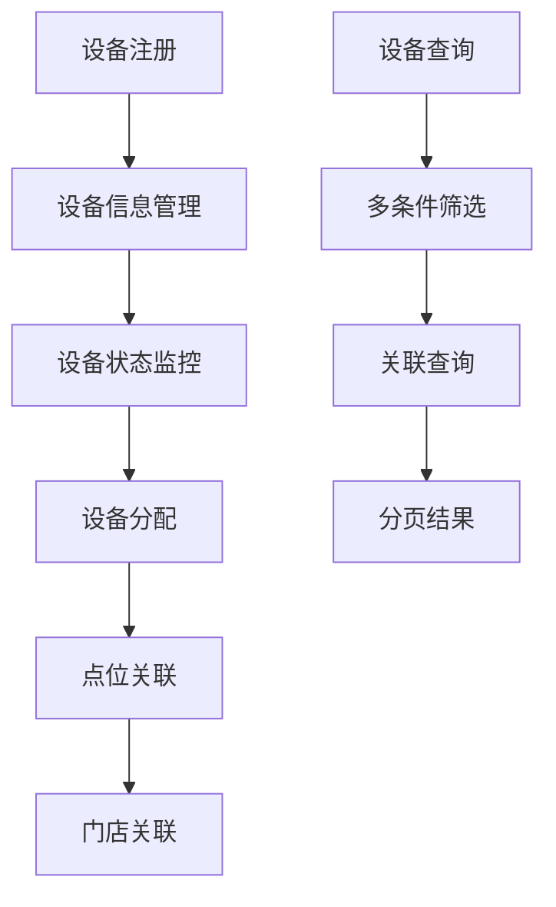

## 4. 门店点位管理架构

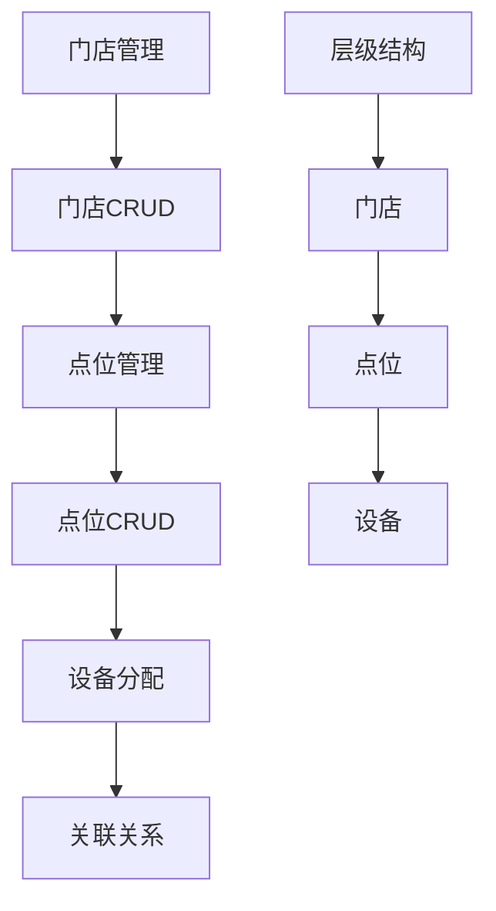

## 5. 聊天对话模块架构

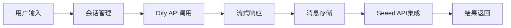

## 6. 用户管理模块架构

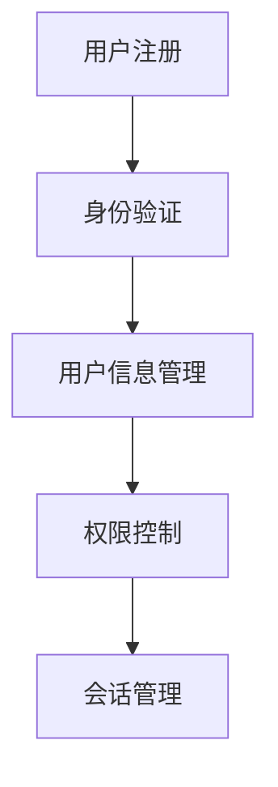

## 7. 代码分层架构

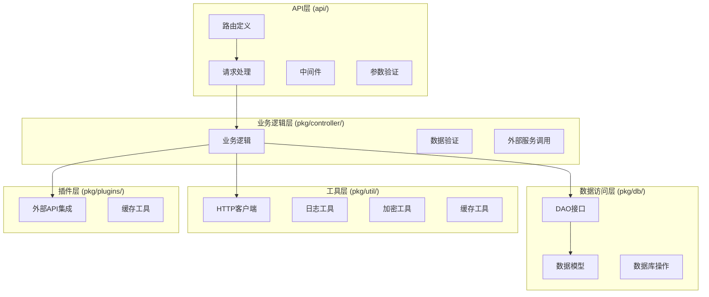

## 8. 录音数据流时序图

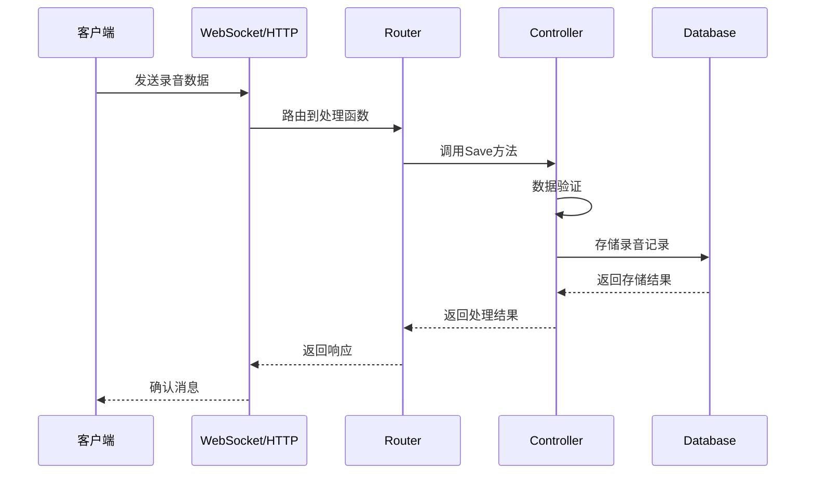

## 9. 聊天对话流时序图

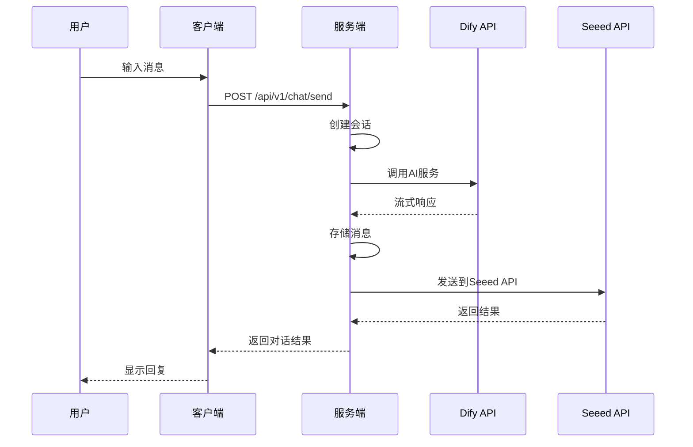

## 10. 部署架构图

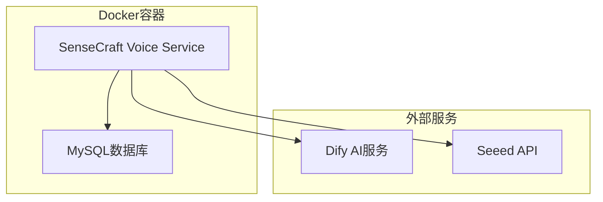

## 11. 模块关系图

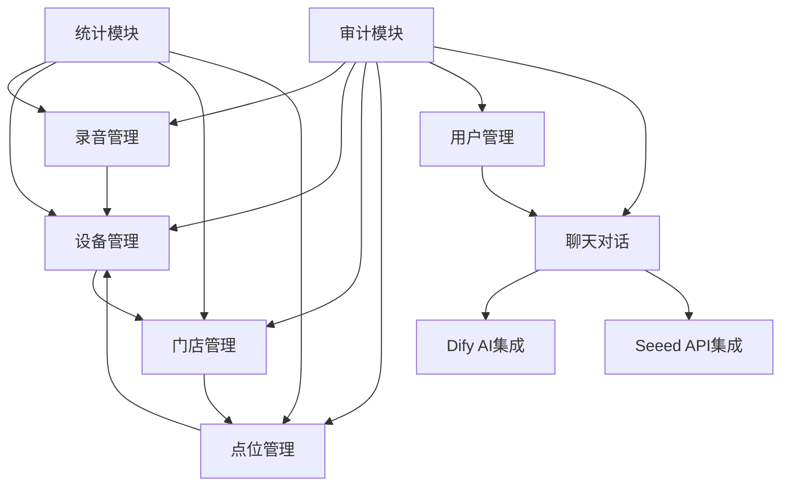

## 12. 数据模型关系图

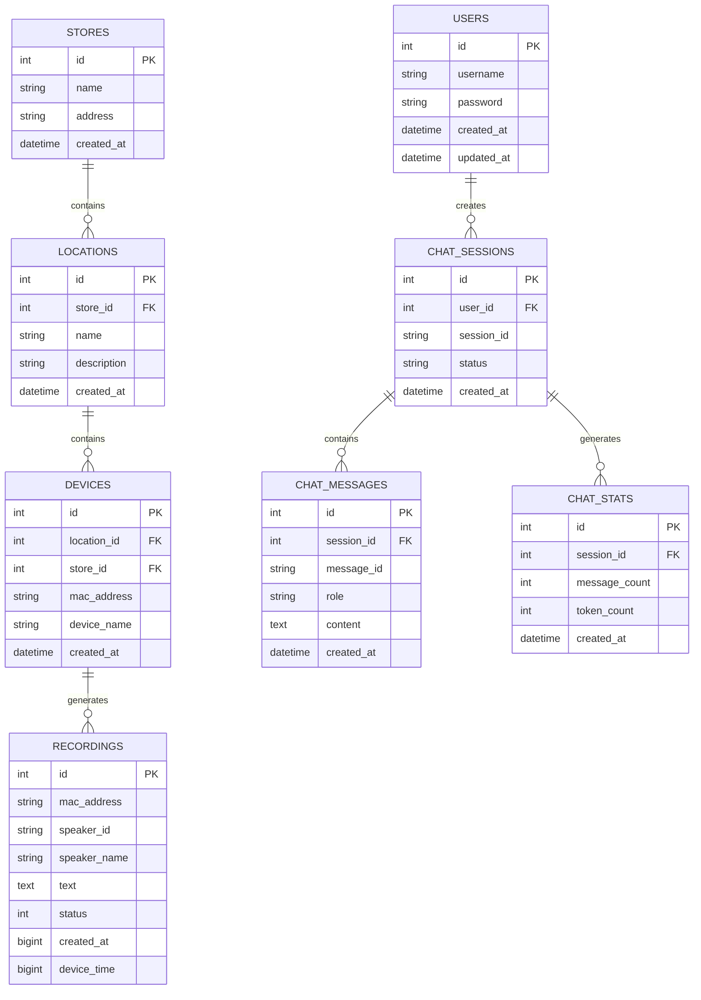
