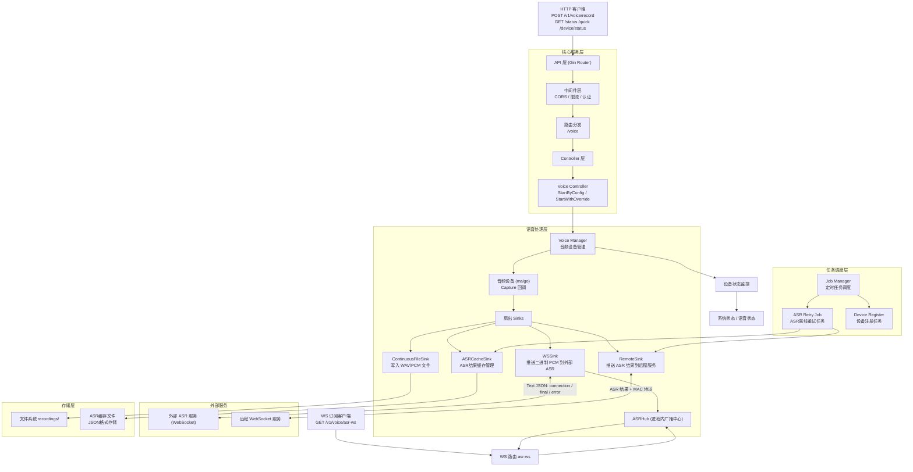

# SenseCraft Voice Client

一个支持本地麦克风采集、文件落盘与 WebSocket 推流到外部 ASR 服务的语音客户端，并提供内部 WS 订阅接口用于实时消费识别结果。

## 🚀 快速开始

### 构建和运行

#### 本地构建
```bash
# 构建可执行文件
make build

# 运行服务
make run
```

#### Docker 构建

##### 单架构构建
```bash
# 构建当前架构镜像
make image

# 构建并推送镜像
make push
```

##### 多架构构建（支持CM4）
```bash
# 构建多架构镜像（AMD64 + ARM64）
make image-multiarch

# 构建并推送多架构镜像
make push-multiarch

# 或者使用专用脚本
./build-multiarch.sh [版本标签]
./build-cm4.sh [版本标签]  # 仅构建ARM64版本
```

#### CM4 (ARM64) 支持

本项目完全支持树莓派CM4 (ARM64) 架构：

- **Dockerfile**: 使用多阶段构建，支持跨平台编译
- **构建脚本**: 提供专门的CM4构建脚本
- **运行时**: 自动检测目标架构，优化性能

在CM4设备上运行：
```bash
# 拉取ARM64镜像
docker pull registry.example.com/respeaker/sensecraft-voice-client:latest-arm64

# 运行容器
docker run -d \
  --name voice-client \
  -p 8090:8090 \
  -v /path/to/config:/etc/sensecraft-voice/config.yaml \
  registry.example.com/respeaker/sensecraft-voice-client:latest-arm64
```

## 关键能力
- 录音控制：启动/停止持续录音，写入 WAV/PCM 文件
- 实时推流：将 PCM16 音频以 WebSocket 二进制帧推送到外部 ASR（参见 `voice.wsUrl`）
- 结果订阅：内部提供 WS 通道转发外部 ASR 的 `connection`/`final`/`error` 消息
- ASR 缓存：当远程服务不可用时，自动缓存 ASR 结果到本地文件系统
- 离线重试：定时任务自动重试上报缓存的 ASR 结果，支持 HTTP 批量上传和 WebSocket 实时上报

## HTTP/WS 接口
- POST `/v1/voice/record`
  - 请求体：
    - `action`: `start` | `stop`
    - 可选覆盖：`deviceId`、`sampleRate`、`channels`、`filePath`、`output`（`file|stream|both`）
  - 说明：请求体提供的字段将覆盖 `config.yaml` 对应配置；未提供的字段沿用配置
- GET `/v1/voice/status`：查询当前是否在录音
- POST `/v1/voice/quick`：快速录制固定时长到文件（见 `docs/apis.md`）
- GET `/v1/voice/asr-ws`：内部订阅通道，实时接收外部 ASR 返回的 `connection`/`final`/`error` 文本消息

更多细节参见：`docs/apis.md`、`docs/asr_ws.md`、`docs/architecture.md`。

## 配置要点（摘录）
`config.yaml` → `voice`：
- `output`: `file|stream|both`（默认 `file`）
- `filePath`: 文件输出目录或文件
- `wsUrl`、`wsHeaders`、`wsChunkBytes`、`wsMaxQueue`、`wsMaxReconnectDelay`：外部 ASR WebSocket 推流参数
- `asrCache`: ASR 缓存配置
  - `enabled`: 是否启用 ASR 缓存（默认 `false`）
  - `cacheDir`: 缓存文件存储目录（默认 `./recordings/asr_cache`）
  - `maxFiles`: 最大缓存文件数量（默认 `1000`）
  - `expireHours`: 缓存文件过期时间（小时，默认 `24`）
  - `httpBatch`: HTTP 批量上传配置
    - `enabled`: 是否启用 HTTP 批量上传（默认 `true`）
    - `batchSize`: 批量大小（默认 `50`）
    - `timeout`: 请求超时时间（默认 `30s`）

## 架构概览

