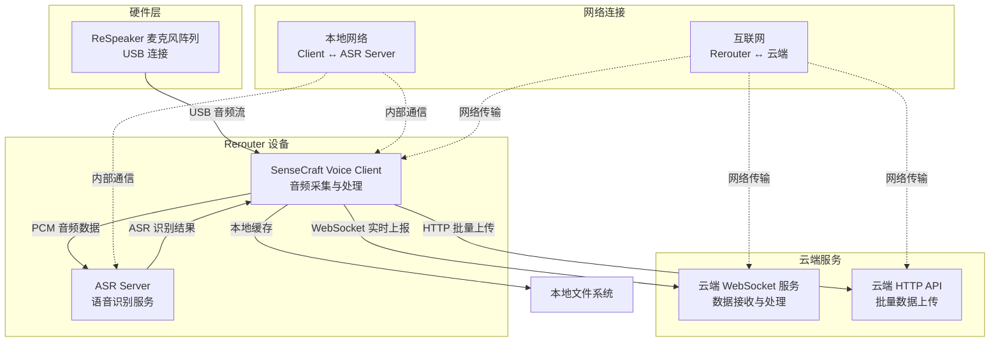
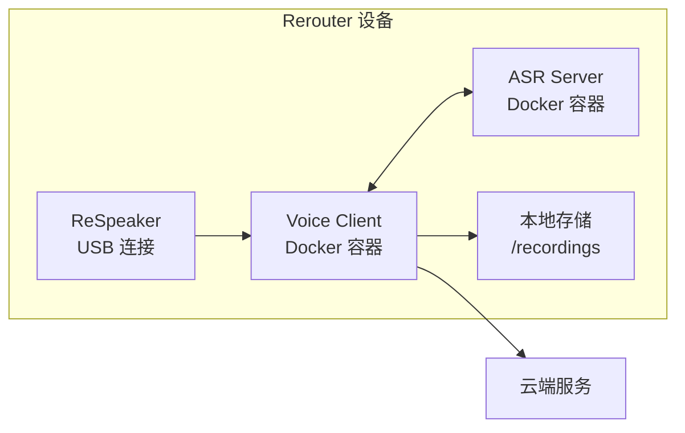

# SenseCraft Voice 系统总体架构

## 系统概述

SenseCraft Voice 系统是一个完整的语音识别解决方案，支持实时音频采集、ASR 处理和云端数据传输。系统采用分布式架构，包含多个组件协同工作。

## 整体架构图



## 组件详细说明

### 1. 硬件层

#### ReSpeaker 麦克风阵列
- **连接方式**: USB 连接到 Rerouter 设备
- **功能**: 实时音频采集，支持多通道音频输入
- **音频格式**: PCM16, 16kHz, 单声道/多声道
- **特点**: 低延迟、高音质、支持远场语音识别

### 2. Rerouter 设备层

#### SenseCraft Voice Client
- **部署位置**: Rerouter 设备上运行
- **主要功能**:
  - 实时音频采集（从 ReSpeaker）
  - 音频数据预处理和格式转换
  - 与 ASR Server 通信
  - 云端数据传输
  - 本地缓存管理
  - 离线重试机制

- **关键特性**:
  - 支持持续录音和按需录音
  - 实时 WebSocket 推流到 ASR Server
  - 智能缓存策略（网络异常时本地存储）
  - 定时任务自动重试上报
  - 多格式音频文件输出

#### ASR Server
- **部署位置**: 与 Client 同机部署在 Rerouter 上
- **主要功能**:
  - 接收 Client 发送的音频流
  - 实时语音识别处理
  - 返回识别结果（文本、置信度、说话人信息等）
  - 支持流式识别和最终结果输出

- **通信协议**:
  - 输入: WebSocket 二进制音频流
  - 输出: WebSocket JSON 文本结果

### 3. 云端服务层

#### 云端 WebSocket 服务
- **功能**: 接收 Client 的实时 ASR 结果
- **数据格式**: JSON 格式的语音识别结果
- **特点**: 低延迟、实时处理

#### 云端 HTTP API
- **功能**: 接收批量上传的 ASR 数据
- **接口**: `POST /api/v1/recordings`
- **用途**: 离线重试、批量数据处理

## 数据流向

### 1. 实时音频处理流程

```
ReSpeaker → Client → ASR Server → Client → 云端 WebSocket
    ↓           ↓         ↓          ↓           ↓
  音频采集   格式转换   语音识别   结果处理   实时上报
```

### 2. 离线重试流程

```
本地缓存 → 定时任务 → HTTP 批量上传 → 云端 API
    ↓         ↓           ↓            ↓
  文件存储   重试调度   批量处理     数据入库
```

## 部署架构

### Rerouter 设备部署



### 容器化部署

- **Voice Client**: 运行在 Docker 容器中
  - 支持多架构（AMD64/ARM64）
  - 自动检测硬件配置
  - 资源限制和监控

- **ASR Server**: 独立容器部署
  - 与 Client 通过本地网络通信
  - 可独立扩展和升级

## 网络架构

### 内部网络（Rerouter 内部）
- **Client ↔ ASR Server**: 本地 WebSocket 连接
- **延迟**: < 1ms
- **带宽**: 音频流 + 识别结果

### 外部网络（Rerouter → 云端）
- **实时上报**: WebSocket 连接
- **批量上传**: HTTP/HTTPS
- **重试机制**: 指数退避算法
- **网络异常处理**: 自动缓存 + 定时重试

## 容错与可靠性

### 1. 网络异常处理
- **实时连接断开**: 自动缓存到本地
- **重连机制**: 指数退避重连
- **数据完整性**: 确保不丢失 ASR 结果

### 2. 离线重试策略
- **定时任务**: 每 30 秒检查待重试文件
- **优先级**: HTTP 批量上传 > WebSocket 实时上报
- **清理机制**: 自动清理过期和超量文件

### 3. 资源管理
- **存储限制**: 最大缓存文件数量控制
- **过期清理**: 自动清理过期缓存文件
- **性能监控**: 实时监控系统状态

## 配置管理

### 关键配置项

```yaml
# Voice Client 配置
voice:
  # 音频采集配置
  deviceId: "default"
  sampleRate: 16000
  channels: 1
  
  # ASR Server 连接
  wsUrl: "ws://localhost:8080/asr"
  
  # 云端服务配置
  remote:
    baseURL: "https://api.example.com"
    wsUrl: "wss://ws.example.com/voice"
  
  # ASR 缓存配置
  asrCache:
    enabled: true
    cacheDir: "./recordings/asr_cache"
    maxFiles: 1000
    expireHours: 24
    httpBatch:
      enabled: true
      batchSize: 50
      timeout: 30s
```

## 监控与运维

### 系统监控
- **音频采集状态**: 实时监控录音状态
- **ASR 处理状态**: 监控识别服务状态
- **网络连接状态**: 监控云端连接状态
- **缓存使用情况**: 监控本地存储使用

### 日志管理
- **结构化日志**: JSON 格式日志输出
- **日志级别**: DEBUG/INFO/WARN/ERROR
- **日志轮转**: 自动日志文件管理
- **远程日志**: 支持远程日志收集

### 性能指标
- **音频延迟**: 端到端音频处理延迟
- **识别准确率**: ASR 识别准确率统计
- **网络传输**: 上传成功率、重试次数
- **资源使用**: CPU、内存、存储使用率

## 扩展性考虑

### 水平扩展
- **多设备支持**: 支持多个 Rerouter 设备
- **负载均衡**: 云端服务负载均衡
- **数据分片**: 大数据量处理能力

### 垂直扩展
- **硬件升级**: 支持更高性能的硬件
- **算法优化**: ASR 算法持续优化
- **网络优化**: 网络传输协议优化

## 安全考虑

### 数据传输安全
- **TLS 加密**: WebSocket 和 HTTP 传输加密
- **身份认证**: 设备身份验证机制
- **数据完整性**: 数据校验和防篡改

### 隐私保护
- **本地处理**: 敏感数据本地处理
- **数据脱敏**: 支持数据脱敏处理
- **访问控制**: 细粒度访问权限控制
